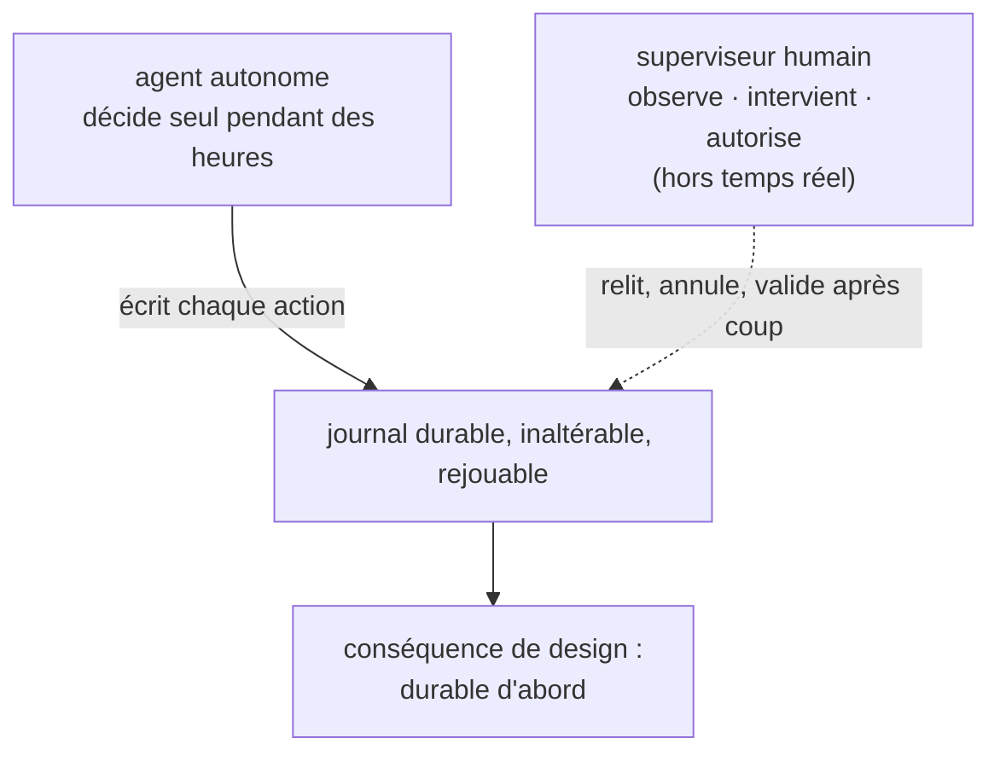

# Un OS conçu pour des humains, utilisé par des agents

L'outillage de nos chaînes de production logicielle bascule vers l'IA, et le mouvement est largement engagé. Le discours qui l'accompagne tourne autour d'un mot : la productivité. On nous montre des assistants qui complètent du code, des copilotes qui résument, des agents qui exécutent des tâches.

Un point commun relie presque tout ce catalogue. Ces outils agissent sur le système au niveau de la couche applicative. Ils s'ajoutent par-dessus l'existant. En cela ils prolongent cinquante ans de production de systèmes d'information, conçus d'un bout à l'autre pour des humains.

Or le mot qui revient le plus dans ces discours est *agent* : un programme qui décide seul, enchaîne des actions, travaille longtemps sans supervision directe. Une question se pose alors. Est-il pertinent de faire travailler un agent sur un système d'information pensé pour des humains, et non pour lui ?

C'est de là qu'est partie ma réflexion. Elle m'a conduit à reprendre le problème un cran plus bas, au paradigme lui-même. Et pour explorer ce que serait un système pensé pour des agents, autant jouer la carte à fond : j'ai demandé directement à des LLM ce qu'ils en pensaient.

> **Cadre.** Cet article et les sept qui suivent rendent compte d'un projet de code personnel, mené par l'expérimentation. Le dépôt Git est public, la documentation et les spécifications sont fournies avec. Je serai heureux d'en discuter, de répondre aux questions et d'entendre les critiques. Rien ici n'est une recommandation d'adoption. Le projet tend vers un système d'exploitation, mais faute d'accès au matériel cible, je n'ai pas pu mener à terme la qualification bare metal.

---

## Quatre prémisses, issues des échanges avec les LLM

De mes échanges avec plusieurs LLM, quatre prémisses se sont dégagées. Elles décrivent ce qu'un agent attend d'un système là où un humain attend autre chose, et elles servent de socle au reste du projet[^premisses].

1. **L'usage de référence est le long-courrier autonome.** L'agent cible vit de l'heure au mois. Il garde un état persistant entre ses actions, en enchaîne des dizaines de milliers à des centaines de millions, n'est supervisé que par intermittence, et délègue à des sous-agents.
2. **L'état se lit et s'écrit en déclaratif.** Un humain sait d'expérience où sont les choses ; un agent, non. Il lui faut un état exposé comme donnée structurée, et un état voulu qu'il déclare, plutôt qu'un texte système à parser et une suite de commandes à composer.
3. **La confiance passe par des capabilities, pas par une identité.** Un droit doit être précis, explicite, révocable à tout moment, et atténuable quand il se délègue. Le comportement d'un agent varie, et une identité stable ne dit rien de ce qu'il fera à l'instant suivant.
4. **L'agent LLM est la cible, mais pas l'étalon.** Un LLM raisonne comme un humain, lentement et en langage. Un système calibré sur lui seul risquerait de viser un humain qui ne dort pas, pas un agent. Le projet retient donc d'abord ce qui resterait vrai pour des agents au profil radicalement différent.

C'est de ces prémisses que découlent les six propriétés du système. Les voici dans l'ordre, chacune répondant à un manque précis[^props].

- **P1 : Densité.** Héberger davantage d'agents dormants sur le même matériel. *(Article 4.)*
- **P2 : Rollback.** Revenir sur l'état local à une transaction antérieure. *(Article 3.)*
- **P3 : Traçabilité.** Retrouver la chaîne causale d'une action dans un journal inaltérable. *(Article 2.)*
- **P4 : Isolation.** Cloisonner chaque agent par des capabilities précises et révocables. *(Article 5.)*
- **P5 : Déterminisme.** Rejouer les transitions d'état d'une exécution pour reproduire un bug. *(Mentionné à l'article 2.)*
- **P6 : Atomicité au crash.** Après un arrêt brutal, retrouver l'état sur la dernière transaction validée. *(Article 6.)*

---

## Le décalage coûte cher

Les systèmes d'exploitation que nous utilisons visent des humains à un terminal. C'est leur histoire, et ils le font remarquablement bien. Leurs hypothèses fondatrices deviennent des coûts concrets dès que l'« utilisateur » est un agent qui vit longtemps et décide seul.

| Hypothèse de l'OS (pensé pour un humain) | Coût pour un agent autonome |
|---|---|
| L'utilisateur perçoit le temps en millisecondes | L'agent enchaîne ses décisions sur des heures ; l'historique prime sur la réactivité instantanée |
| L'état s'accumule implicitement | Aucun moyen propre de prendre un instantané ou de revenir en arrière sans bâtir soi-même l'infrastructure |
| L'observabilité se reconstruit après coup | Retracer la causalité d'une décision oblige à corréler plusieurs journaux disparates |
| L'identité tient au compte Unix | Aucune primitive native pour « délègue ce droit à un sous-agent cinq minutes, puis révoque-le » |
| Le parallélisme est borné par l'attention humaine | Un conteneur par agent immobilise de la RAM pendant que l'agent dort, ce qui borne le nombre d'agents hébergeables (l'article 4 le chiffre, avec son substrat de mesure) |

Chacune de ces lignes est un choix correct pour l'utilisateur d'origine. Elles cessent de l'être quand l'utilisateur change de nature.

---

## Le signal le plus clair : ce que les praticiens ré-implémentent

Le décalage est déjà visible dans les outils que la communauté des agents construit par-dessus l'OS, pour reconstituer ce qu'il laisse à leur charge.

- **Temporal** ré-implémente l'exécution durable et le rejeu, au niveau applicatif.
- **LangGraph** ré-implémente la gestion explicite de l'état, au niveau applicatif.
- Divers frameworks de checkpoint et de rollback ré-implémentent l'état transactionnel, au niveau applicatif.

C'est la signature historique d'une **abstraction manquante**. Le ramasse-miettes était applicatif avant que les langages ne l'intègrent. La persistance transactionnelle était refaite dans chaque application avant que les bases embarquées ne la standardisent. À chaque fois, le même schéma : une couche que tout le monde réécrit finit par descendre d'un cran, dans le substrat.

La question de ce projet est exactement celle-là : **quelles abstractions, descendues au niveau de l'OS, supprimeraient cette couche que tout le monde réécrit aujourd'hui pour ses agents ?**

---

## L'observation qui structure tout : la supervision est asymétrique

Si l'on ne devait retenir qu'une idée, ce serait celle-ci.

Un humain qui supervise un agent autonome agit autrement qu'avec un programme interactif. Il intervient hors du temps réel. Il observe (relire ce qui s'est passé), intervient (annuler, révoquer un droit), autorise (valider une étape sensible). Entre deux interventions, l'agent vit sa vie[^supervision].

Cette asymétrie façonne tout le reste. Le superviseur étant hors de la boucle à la microseconde, le système se conçoit durable d'abord. L'historique des décisions doit être inaltérable et rejouable, parce que c'est par lui que l'humain comprend après coup. La cible de réactivité d'une recherche dans cet historique est celle d'un humain qui peut attendre.

La cible d'optimisation est donc claire : pouvoir, après coup et de façon fiable, savoir ce que l'agent a fait et le défaire si besoin.

*Schéma conceptuel. L'asymétrie de supervision (l'humain hors de la boucle temps réel) autorise et impose un journal durable d'abord.*

---

## Du besoin au substrat

Ces six propriétés, et la durabilité d'abord qu'impose la supervision asymétrique, posent des contraintes précises à la couche d'exécution : isolation forte entre agents, écriture en ajout seul, interception des effets, sources de hasard substituables. Plutôt que de partir d'une pile par habitude, j'ai transformé ces contraintes en grille d'évaluation et confronté les substrats candidats[^substrat].

Deux choix en ressortent pour le prototype mesuré, sur Linux. Un runtime WebAssembly, Wasmtime, écrit en Rust, porte l'isolation et la densité : un module pèse bien moins qu'un conteneur, et Rust écarte le surcoût d'un ramasse-miettes. Un moteur de stockage LSM, RocksDB, porte le journal en ajout seul : il est taillé pour l'écriture séquentielle soutenue et le lookup par clé opaque, là où un moteur relationnel paierait une amplification d'écriture inutile.

Un second prototype porte le même modèle sur seL4, l'un des rares micro-noyaux dont la correction fonctionnelle est prouvée par la machine. Le moteur de stockage y devient redb, et les bornes mesurées sur Linux ne lui sont pas transférées[^sel4].

Aucun de ces choix n'est posé comme une évidence. Chacun est un pari dont la condition de réfutation a été écrite *avant* l'expérience, et l'article 7 les reprend un par un.

---

## Statut du projet

Le statut, posé net, parce que la précision est ici le seul argument qui tienne.

**C'est un prototype de recherche.** Son but est d'isoler un besoin que Linux ne sert pas par construction, de proposer des abstractions qui y répondent, et de les mettre à l'épreuve, jusqu'à les attaquer et publier les cas où les données ont contredit le design.

Le projet a produit deux artefacts concrets[^overview]. Le prototype Linux a été validé de bout en bout contre les propriétés mesurables et falsifiables, dont les cibles ont été fixées *avant* l'expérience. Le prototype seL4 a démontré une chaîne d'intégration complète et fonctionnelle, en émulation QEMU AArch64.

Une nuance de fond, dite une fois. Ce système gouverne les *effets* et les *ressources* d'un agent : ce qu'il a le droit de toucher, ce qu'il consomme, ce qu'on peut annuler. La qualité de ses décisions relève d'un autre plan, hors de son emprise[^frontiere]. Un modèle qui raisonne mal à l'intérieur de son périmètre de droits reste dans le cadre prévu. Promettre qu'un OS « rend l'IA fiable » serait une survente, et le projet a fait de cette limite une règle de méthode.

---

## La suite

Cet article posait le *pourquoi*. Les sept suivants montrent *comment on sait que c'est vrai*, chacun avec sa preuve, son régime, sa nuance.

Le prochain attaque le cœur visible du système. Quand deux agents collaborent, le lien entre la décision de l'un et celle de l'autre est un hash. Toute réécriture de l'historique devient alors détectable, et cet historique se rejoue à l'identique. C'est ce qui distingue le plus ce système d'une API de modèle sans mémoire.

*Article 2 : « La flèche entre deux décisions d'agent est un hash ».*

---

*Série Torpor. Les bornes chiffrées des articles suivants sont citées avec leur substrat de mesure et leur condition de réfutation. Code sous licence Apache-2.0, documentation sous CC-BY-4.0.*

[^premisses]: `spec/01-vision.md` §2 « Le constat » : ce qu'un agent fait différemment d'un humain (profil d'usage, rapport à l'état, à la confiance, portée épistémique).
[^props]: `spec/02-properties.md` : les six propriétés P1 à P6 et leurs critères de vérification.
[^supervision]: `decisions/0006-modele-supervision.md` et `decisions/0013-architecture-supervision.md` : modèle de supervision asymétrique.
[^substrat]: `spec/02b-substrate_requirements.md` (contraintes imposées au substrat) et `decisions/0002-choix-substrat.md` (grille d'évaluation et choix des moteurs).
[^overview]: `OVERVIEW.md` : vue d'ensemble du projet.
[^sel4]: `ADR-0065` : position seL4 (réserves permanentes, périmètre des bornes chiffrées).
[^frontiere]: `spec/08-modele-menace.md` : non-objectifs, dont la frontière LLM.
