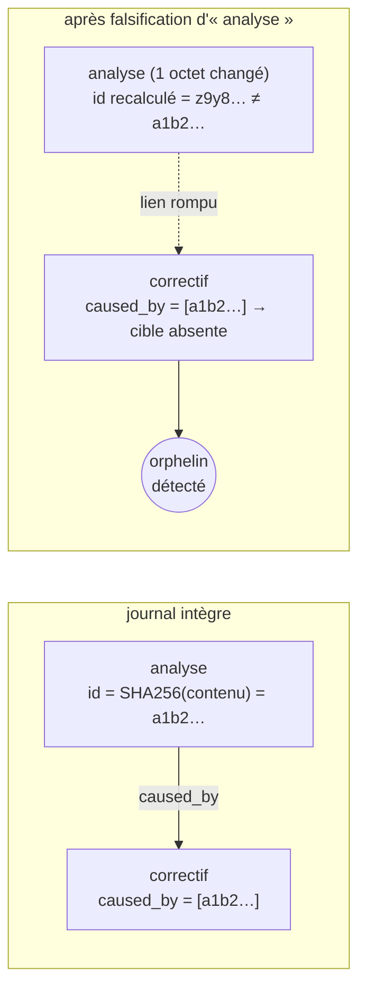
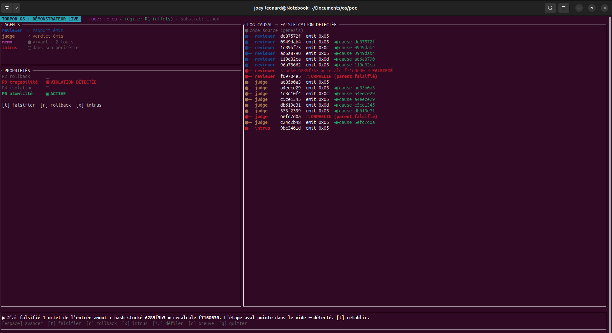

# La flèche entre deux décisions d'agent est un hash

Les décisions d'un agent autonome s'enchaînent causalement : une correction découle d'une analyse, une action s'appuie sur la précédente. Ce lien entre deux décisions est une donnée à conserver, au même titre que les décisions elles-mêmes. Dans la plupart des systèmes, il ne tient qu'à une ligne de log applicative, du texte éditable et dissociable de l'action qu'il décrit. Reconstituer ce qu'un agent a fait, et dans quel ordre, revient alors à faire confiance à ce texte.

Ce projet conserve ce lien sous une autre forme : un hash. L'identifiant d'une action est le SHA-256 de son contenu, et chaque action cite les identifiants de celles dont elle découle. Voici l'illustration autonome du bundle, sans le moteur ni le DAG réel, rejouable en trente secondes :

```
analyse    id = 8be89c…171a696
correctif  id = d2ff79…d184f9    caused_by = [8be89c…171a696]
```

Ici, `8be89c…` est cette empreinte, calculée sur le contenu de l'analyse ; le correctif la reprend dans son champ `caused_by`. La flèche entre les deux décisions est cryptographique, et le runtime applique cette règle exacte sur le vrai journal causal.

---

## Comment on trace aujourd'hui

Une API de modèle de langage est sans état. Un contexte entre, une réponse sort, et le lien entre les deux ne survit que dans la journalisation applicative qu'on tient soi-même : dans le format qu'on a choisi, modifiable ensuite. C'est la voie la plus répandue, et ce n'est pas la seule.

Les systèmes de tracing à fort volume (Jaeger, Honeycomb) enregistrent fidèlement ce qui s'est passé, mais leur métier est l'observabilité, pas la preuve : on peut y réécrire après coup. Les moteurs d'exécution durable rejouent un historique d'événements et reprennent après une panne, au niveau applicatif. L'adressage par contenu et la preuve par hachage, eux, sont éprouvés de longue date : Git identifie chaque commit par l'empreinte de son contenu, Nix chaque paquet par celle de ses entrées. Personne, en revanche, ne descend ce principe jusqu'au journal d'actions d'un agent, au niveau du système.

Pour un agent qui décide seul pendant des heures, la question est précise : **comment prouver ce qu'il a fait, et dans quel ordre ?** Un historique éditable répond « probablement ceci ». Un historique adressé par le contenu répond « exactement ceci, ou alors la preuve casse ».

---

## Un journal causal adressé par le contenu

Chaque action d'un agent est enregistrée sous un identifiant qui **est le hash de son contenu** (SHA-256). Changez un octet de l'action, son identifiant change, et tous les liens qui pointaient vers l'ancien tombent dans le vide.

Concrètement, ce journal est le *CausalLog*, un magasin en ajout seul, jamais réécrit. Sur le prototype mesuré, sur Linux, il repose sur RocksDB, un moteur clé-valeur embarqué de type LSM[^emit]. La clé d'une entrée est l'`action_id`, le SHA-256 de l'entrée sérialisée. La valeur est la `LogEntry` : l'agent émetteur, un numéro de séquence, un horodatage, les parents causaux (`caused_by[]`), l'empreinte de l'état après l'action, et la charge utile éventuelle. Sur la cible seL4, le moteur de stockage devient redb[^sel4].

Le champ `caused_by[]` est une liste, parce qu'une décision peut dépendre de plusieurs autres survenues en parallèle. La structure est donc un **graphe orienté acyclique (DAG)**[^dag].


*Schéma conceptuel. L'identifiant est le hash du contenu. Falsifier « analyse » change son id, et la référence `caused_by` du « correctif » pointe alors dans le vide.*

> **En préalable de l'expérience, un premier pari architectural a été fait.** Plusieurs agents en parallèle produisent de la vraie concurrence : la décision C dépend de A *et* de B, survenues indépendamment. Une chaîne forcerait à sérialiser ; un arbre interdirait les fusions. Le pari : le DAG est la structure correcte. Condition de réfutation posée d'avance : trouver un cas où la sémantique DAG crée un défaut de correction. Sur l'ensemble des expériences multi-agents, ce cas n'est pas apparu.

Le journal est **append-only** : on ajoute, jamais on ne réécrit. Toute altération casse l'égalité « identifiant = hash du contenu », et se voit. C'est ce qu'on appelle *tamper-evident*.

---

## On triche, et le système le voit

L'expérience est directe. On part d'un vrai journal, on change un seul octet dans l'entrée « analyse », et on recalcule son identifiant. Voici la sortie :

```
id stocké    = 8be89c…171a696
id recalculé = 15f821…571346
le correctif pointe vers 8be89c…171a696
orphelin détecté ? true
```

L'identifiant recalculé ne tombe plus sur l'identifiant stocké. Le « correctif » continue de pointer vers `8be89c…`, qui n'existe plus sous cette forme, et le système signale l'orphelin tout seul. Tout le mécanisme tient en une égalité vérifiée à froid, `clé == SHA256(octets bruts)`, complétée par la détection des parents pendants. Aucune confiance n'est accordée au contenu : seule l'arithmétique du hachage tranche.

Le démonstrateur `demo-tui` met la scène sur un pipeline `reviewer → judge`. La touche `[d]` révèle les hashes complets, la touche `[t]` falsifie une entrée à la volée :

```bash
cd poc
CXXFLAGS="-include cstdint" cargo run -p os-poc-runtime --features demo-tui \
  --bin demo-tui -- --scene effects
# Au clavier : [d] affiche les hashes complets · [t] falsifie une entrée
```


*Scène `effects`, touche `[t]` : un octet modifié suffit, l'id recalculé ne tombe plus sur l'id stocké et l'entrée aval devient orpheline. Capture réelle, substrat PoC Linux.*

Hors démo interactive, un vérificateur tiers tranche par un code de sortie : sur un journal corrompu d'une seule entrée, il sort en erreur et désigne la bonne `action_id`[^integrite].

> **Note de méthode.** Ces opérations agissent sur le journal, pas sur l'inférence. Elles sont identiques que le modèle tourne pour de vrai (`--live`) ou en rejeu, parce que le contrôle des effets ne dépend pas du modèle. Et ce rejeu reconstruit le même état : le runtime substitue les deux seules sources de hasard, l'horloge et l'aléa, ce qui rend les transitions déterministes, la propriété P5. Aucune performance d'inférence n'est revendiquée ici.

---

## Assez rapide pour un audit interactif

Un journal dont toute altération se voit n'a de valeur que si on y retrouve une action à la demande. La récupération par identifiant a été mesurée sur le PoC Linux (Rust/Wasmtime/RocksDB)[^config].

| Jeu de données | Régime | p99 | Cible |
|---|---|---|---|
| 10⁸ entrées | lecture seule, journal statique | 1,4 à 1,9 ms (4,9 pire cas) | 10 ms |

Le p99 reste sous la cible de 10 ms : sept fois moindre pour la passe typique (1,4 ms), deux fois moindre pour la pire passe observée (4,9 ms). La mesure : un journal synthétique de 10⁸ entrées (`populate_synthetic`), trois passes de 10 000 `get(action_id)` tirés au hasard, caches vidés avant chaque passe, p99 retenu[^mesures]. Et la portée, nommée franchement : c'est un lookup isolé sur un journal figé, en lecture seule, la mesure la plus étroite. Elle donne la latence structurelle de l'index, pas le coût qu'un agent paie en production. Le cycle complet « émettre puis relire avec garantie de durabilité » porte une cible distincte (≤ 20 ms, dominée par le fsync) et reste à mesurer ; le régime multi-agent concurrent est borné plus large encore. Aucune de ces deux portées n'est revendiquée ici.

Le choix d'un moteur LSM plutôt qu'un B-tree est le deuxième pari architectural : sur un journal en ajout seul interrogé par clé opaque, l'amplification d'écriture s'amortit à la compaction, et les filtres de Bloom évitent les accès disque sur les clés absentes. Ces bornes valent pour RocksDB sur Linux ; elles ne sont pas transférées à la cible seL4, qui tourne sous redb.

---

Ce journal prouve l'intégrité de l'historique. Il ne juge pas la qualité des décisions : un agent qui raisonne mal laisse une trace parfaitement intègre de mauvaises décisions. Il trace les effets. C'est ce qu'on lui demande.

---

## La suite

Toute réécriture de l'historique se voit. Reste à savoir ce qu'on en fait. Parce que chaque état est un point nommé dans ce DAG, on peut y revenir : rembobiner l'état local d'un agent de 500 décisions en arrière, tout ou rien, en quelques dizaines de millisecondes.

*Article 3 : « Annuler 500 décisions en 17 millisecondes ».*

---

> **Reproduire.** Les commandes et la sortie attendue sont dans `examples/blog-02-dag-causal/REPRODUCE.md`, épinglé au tag de l'article. Le vérificateur tiers se lance hors interface : `cargo run -p os-poc-runtime --bin log-verify -- <chemin-log>` (sortie 0 intègre, 1 altération avec l'`action_id` fautif, 2 erreur).

---

*Série Torpor. Bornes citées avec leur substrat de mesure et leur condition de réfutation. Code Apache-2.0, documentation CC-BY-4.0.*

[^emit]: `decisions/0010-contrat-emit.md` : contrat `emit()` et `action_id` adressé par contenu ; code dans `poc/causal-log/`.
[^sel4]: `ADR-0065` : position seL4 (réserves permanentes, périmètre des bornes chiffrées).
[^dag]: `decisions/0003-modele-causal-dag.md` : modèle causal DAG (`caused_by[]`).
[^integrite]: `decisions/0018-os-poc-reconstruct-minimal.md` : vérification d'intégrité (`log-verify` et `log-dump`).
[^mesures]: propriétés P3a et P6 dans `spec/02-properties.md` ; mesures dans `results/` (T5 / SEF-5, `verdict.json`) ; options RocksDB du PoC Linux dans `decisions/0011-options-rocksdb-layer0.md`.
[^config]: Matériel de mesure, classe grand public : AMD Ryzen 5 PRO 4650U, NVMe WD SN530. La qualification P3a a aussi tourné sur une classe AWS i3en.xlarge, plus rapide ; les bornes citées sont celles de la classe grand public, la plus conservatrice.
