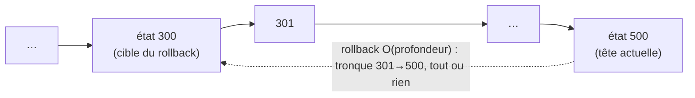
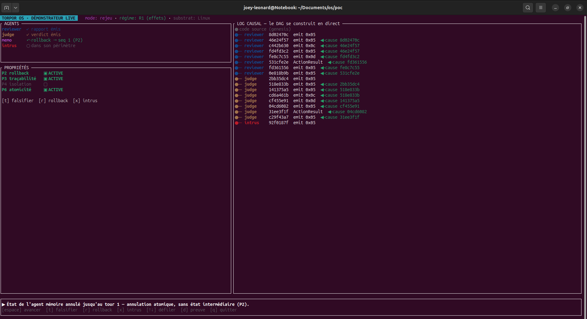
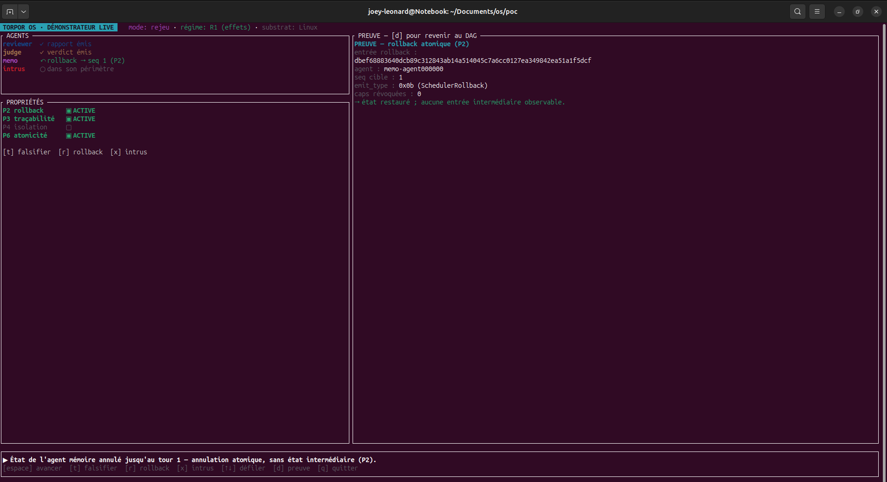

# Annuler 500 décisions en 17 millisecondes

L'état d'un agent est cumulatif : chaque décision s'appuie sur les précédentes, et une erreur, un mauvais sous-objectif ou un résultat intermédiaire corrompu, se propage dans tout ce qui suit. Sans moyen de revenir en arrière, il ne reste que des issues coûteuses : repartir de zéro, ce qui jette aussi tout le travail valide ; continuer sur l'état corrompu, ce qui laisse l'erreur s'amplifier ; ou réparer cet état en place, ce qui dépense du temps et des tokens à colmater les dégâts au lieu d'avancer. Le rollback revient moins cher, en temps comme en tokens : on repart du dernier état stable, sans tout refaire depuis le début, et sans s'épuiser à réparer un état qu'on écarte plutôt qu'on ne corrige. Au-delà de l'agent, un superviseur en a besoin pour intervenir : rembobiner à un état sain, là où arrêter puis relancer détruirait le contexte accumulé. C'est sa primitive d'intervention principale.

Cette capacité existe ailleurs, sous des formes pensées pour d'autres usages. Le checkpoint/restore de processus (CRIU) restaure un état antérieur, au prix d'un coût en O(N) sur la taille de l'état sérialisé et de durées de plusieurs secondes. Les bases de données transactionnelles (MVCC : PostgreSQL, SQLite WAL) annulent proprement, mais sur les seuls tuples modifiés, pas sur l'état complet d'un agent ni sur ses messages en transit. La compensation écrite à la main, elle, est refaite par application, fragile, et rarement transactionnelle : elle peut laisser un état à moitié défait. Chacune se reconstruit au-dessus du système, parce que le système ne la fournit pas.

Ici, le rollback est une primitive du système. Ramener un agent à un état antérieur est une seule opération, transactionnelle, dont le coût suit la profondeur du retour et non la taille de l'historique. Son état local revient au point demandé, tout ou rien.

---

## Rollback transactionnel en O(profondeur)

L'article précédent a posé le socle : chaque état est un point nommé dans un DAG causal (un graphe orienté acyclique) adressé par le contenu. Le rollback en est l'usage direct.

Revenir à l'état N remonte le DAG causal à l'envers, de la tête jusqu'à la cible. Le coût est en **O(profondeur)**, là où rejouer les actions ou scanner l'historique coûterait O(N). L'opération est **transactionnelle** : elle aboutit complètement, ou pas du tout. Aucun état « à moitié annulé » n'existe.


*Schéma conceptuel. Le rollback remonte le DAG de la tête (500) jusqu'à la cible (300) en O(profondeur). Les états 301→500, et les capabilities accordées entre-temps, sont invalidés ensemble.*

Un effet important, que détaille l'article 5 : un rollback **invalide les capabilities** accordées entre l'état cible et l'état courant. Revenir à l'état 300 retire aussi les droits délégués à l'état 450[^caps].

---

## La preuve : la mesure

Le scénario d'équivalence fonctionnelle SEF-2 revient sur cinq cents décisions et vérifie que l'état restauré a le même hash que l'état cible. La latence de ce rollback bout-en-bout :

| Scénario | Profondeur | p95 | Cible |
|---|---|---|---|
| Rollback bout-en-bout (SEF-2) | 500 | 17 à 20 ms | 100 ms |

Le p95 tient cinq fois sous la cible de 100 ms, fixée avant la mesure. Ce chiffre est mesuré en cache chaud, sur un seul run ; la qualification à froid, avec un jeu de données débordant le cache, reste à faire[^config]. Il inclut l'orchestration de supervision : le rollback du store seul reste sous la milliseconde, même à profondeur 1000 (837 µs)[^mesure]. Le coût des 17 à 20 ms est donc dans l'orchestration, pas dans la traversée du store.

Le démonstrateur met le rollback en scène sur un agent vivant. La touche `[r]` déclenche un vrai `Message::Rollback` : l'état local recule, et la couche preuve montre que le DAG a été tronqué proprement à la cible.

```bash
cd poc
CXXFLAGS="-include cstdint" cargo run -p os-poc-runtime --features demo-tui \
  --bin demo-tui -- --scene effects
# Au clavier : [r] rollback sur un dialogue vivant
# Variante : --scene mission-resume (reprise d'une tâche sans tout recalculer)
```


*Scène `effects`, touche `[r]` : l'état local recule d'un bloc jusqu'au tour 1, sans état intermédiaire observable (P2).*


*La couche preuve : `emit_type 0x0b (SchedulerRollback)`, cible `seq 1`, « état restauré ; aucune entrée intermédiaire observable ».*

La scène `mission-resume` va plus loin : une tâche en quatre étapes est interrompue puis reprise sans tout recalculer, parce que la traçabilité de l'article 2 rend la reprise possible.

> **Note de méthode.** Le rollback agit sur le journal et les capabilities, pas sur l'inférence. La touche `[r]` est identique en rejeu et en `--live` : on démontre le contrôle des effets, pas une performance du modèle.

---

## Le périmètre : l'état local

Tout ce que ce système gouverne tient dans un périmètre local : l'état de l'agent, son journal causal, ses capabilities vivent à l'intérieur du système, sous son contrôle direct. C'est une décision de conception, pas une limite subie. Le projet se donne pour objet ce qui se passe dans ce périmètre, là où il peut offrir des garanties, et le rollback agit dans ce périmètre, et seulement là.

Un effet qui en est déjà sorti échappe à cette garantie. Si l'agent a, entre l'état 300 et l'état 500, envoyé un e-mail ou appelé une API tierce, revenir à l'état 300 laisse ces effets en place : le monde extérieur les a vus, et aucun rollback ne les rappelle. La compensation de ces effets externes, les « sagas », est un non-objectif documenté du projet[^saga].

Dans ce prototype, le rollback garantit le retour de l'état local et l'invalidation des capabilities concernées, et rien au-delà.

---

## La suite

On a un historique vérifiable (article 2) et la capacité d'y revenir (article 3). Reste le coût : combien d'agents une machine peut-elle entretenir si chacun garde son état ? L'article suivant chiffre ce coût, avec sa portée et ses réserves.

*Article 4 : « Le coût d'un agent endormi ».*

---

> **Reproduire.** Les commandes et la sortie attendue sont dans `examples/blog-03-rollback/REPRODUCE.md`, épinglé au tag de l'article.

---

*Série Torpor. Bornes citées avec leur substrat de mesure et leur condition de réfutation. Code Apache-2.0, documentation CC-BY-4.0.*

[^caps]: `decisions/0007-rollback-caps-invalidation.md` (invalidation des capabilities au rollback) et `decisions/0005-design-capabilities-revoke.md` (design et révocation).
[^mesure]: scénario SEF-2 et mesures dans `results/` (`verdict.json`) ; code `Message::Rollback` dans `poc/runtime/src/`, scènes dans `demo_tui.rs`.
[^config]: Machine de mesure : AMD Ryzen 5 PRO 4650U, NVMe WD SN530. Régime cache chaud (la chaîne de headers tient dans le cache RocksDB), un seul run ; qualification à froid en attente.
[^saga]: propriété P2 dans `spec/02-properties.md` ; non-objectif saga (compensation des effets externes) dans `spec/05-non-goals.md`.
