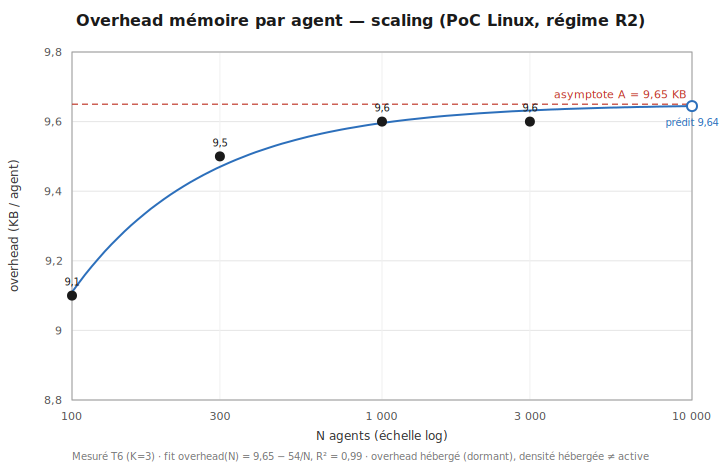
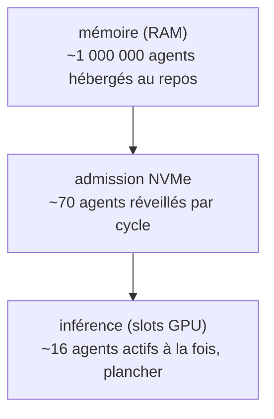
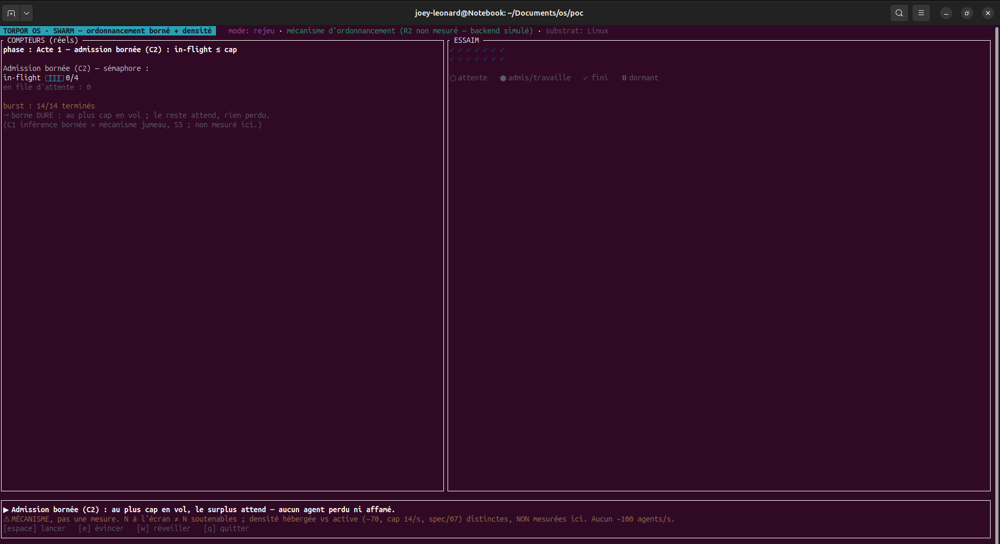
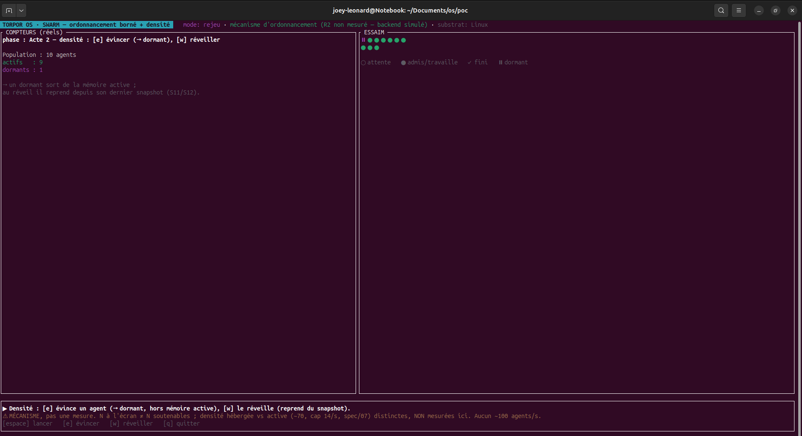

# Le coût d'un agent endormi

Un agent long-courrier passe le plus clair de son existence au repos. Il attend un événement, la validation d'un superviseur, l'étape suivante d'une tâche qui s'étale sur des jours. Dès qu'on en fait tourner beaucoup, à tout instant la plupart dorment. Ce que coûte un agent au repos décide donc combien on peut en garder sur une machine. Dans cet article, un agent dormant désigne un agent au repos entre deux actions, son état rangé sur NVMe, réveillé à la demande.

La façon courante de faire tourner un agent aujourd'hui est un conteneur par agent : Docker et un runtime Python, avec les bibliothèques d'orchestration LLM chargées en mémoire, le SDK du modèle, le client HTTP, la validation. Même au repos, ce conteneur garde l'interpréteur Python et toutes ses dépendances résidents, soit quelques dizaines de méga-octets par agent. Multiplié par des milliers d'agents dormants, ce coût de stockage domine la facture mémoire. C'est la référence que ce système cherche à alléger.

Un conteneur isole en donnant à chaque agent son propre processus, son espace d'adressage et son userland. WebAssembly procure l'isolation par un autre moyen. Chaque agent s'exécute dans un bac à sable dont la frontière est inscrite dans la sémantique du module, vérifiée à la compilation : sa mémoire linéaire est la seule qu'il peut lire ou écrire, et il atteint l'extérieur uniquement par les fonctions qu'on lui accorde explicitement. Comme cette frontière est garantie par le module lui-même, plusieurs agents tiennent dans un seul processus partagé, et c'est de là que vient la légèreté. Le moteur garde une seule copie du module compilé pour tous, et chaque agent est une instance dont la mémoire linéaire n'est adossée à de la RAM qu'à mesure qu'il l'écrit, page par page. Un agent dormant qui n'a rien écrit ne coûte donc que son instance, quand le conteneur garde tout un userland résident. C'est ce qui a guidé le choix de WebAssembly pour le substrat ; la comparaison se fait contre la norme du conteneur par agent, les machines virtuelles étant plus lourdes encore.

---

## Le coût d'un agent au repos

Un agent dormant occupe en moyenne 9,65 kilo-octets de RAM sur le PoC Linux[^config], contre 37 à 43 méga-octets pour le conteneur Docker et Python équivalent, mesuré sur la même machine au repos.

| Métrique | Wasmtime | Docker + Python | Rapport |
|---|---|---|---|
| RAM par agent dormant (asymptotique) | ~9,65 KB | ~37 à 43 MB | 4 539 à 7 375× |

Ce coût a été suivi en fonction du nombre d'agents, et il ne dérive pas. Quatre tailles ont été mesurées, de 100 à 3 000 agents, trois exécutions chacune, et le meilleur ajustement est :

> overhead(N) = 9,65 − 54/N kilo-octets par agent (R² = 0,988)

Le terme 54/N tient à des coûts fixes partagés entre tous les agents, comme le binaire WASM et le runtime, qui s'amortissent à mesure que N grandit. Au-delà de 300 agents environ, l'overhead par agent se stabilise autour de 9,65 KB : chaque agent supplémentaire coûte la même chose. Prédiction à N = 10 000 : 9,64 KB par agent[^densite].


*Figure 1 — overhead par agent vs N (T6, K=3). Le fit `overhead(N) = 9,65 − 54/N` (R² = 0,988) sature à 9,65 KB ; prédiction à N = 10 000 : 9,64 KB. Substrat PoC Linux, régime R2 ; overhead hébergé, densité hébergée ≠ active.*

Un troisième pari architectural se lit dans ce résultat. L'isolation d'un module WebAssembly devait être plus légère qu'un conteneur par agent, et la condition de réfutation, écrite avant la mesure, était simple : voir l'overhead par agent croître avec N, signe d'une fuite ou d'un coût non amorti. Il décroît vers une asymptote. Le pari tient, sur ce substrat, pour cette métrique.

---

## Densité hébergée, densité active

Ce chiffre mesure une chose précise : la densité hébergée, combien d'agents on peut garder en mémoire au repos. Extrapolé à une machine de 16 Go, il donne de l'ordre du million d'agents dormants. Le nombre reste théorique, très au-delà des 3 000 agents réellement mesurés, mais il décrit bien un coût de stockage : garder un agent au repos est quasi gratuit.

Le nombre d'agents qui peuvent travailler en même temps est une tout autre quantité, et bien plus petite. Un agent qui calcule occupe un slot d'inférence, et ces slots sont en nombre fixe. C'est ce qu'on appelle le mur de l'inférence : héberger un agent au repos est presque gratuit, le faire calculer demande un slot, et les slots se comptent. Leur nombre dépend du modèle et du GPU. Pour la configuration de référence, un modèle de 7 milliards de paramètres sur un GPU de 24 Go, le pool sert environ huit requêtes à la fois, chacune durant 2,5 secondes ; sur un cycle de 5 secondes, cela soutient de l'ordre de 16 agents actifs en parallèle. Ce plancher tient indépendamment du million d'agents qui dorment en RAM, et il vaut même sur bare metal. Ce n'est pas la mémoire qui borne le travail, mais le mur de l'inférence[^plafonds].


*Schéma conceptuel, PoC Linux. Trois plafonds se superposent ; le travail simultané est borné par le plus bas, l'inférence.*

Trois plafonds se superposent, et c'est le plus bas qui décide. La mémoire pourrait héberger de l'ordre du million d'agents. L'admission depuis le NVMe pourrait en réveiller de l'ordre de 70 par cycle. L'inférence n'en sert qu'une quinzaine à la fois. C'est elle qui mord.

Cette densité active n'est pas mesurée bout-en-bout : la quinzaine d'agents actifs est un calcul, à partir d'un temps d'inférence mesuré et d'un nombre de slots estimé, et la comparaison frontale avec un conteneur en charge reste à produire. Le grand chiffre, lui, décrit un coût de stockage réel ; il ne dit rien du nombre d'agents au travail.

---

## Latence de réveil, et statut de P1

L'intérêt d'une forte densité dormante tient à un réveil rapide. Celui-ci est mesuré, en régime de cache chaud sur état minimal[^reveil] :

| Condition | p99 | Budget |
|---|---|---|
| Référence (N=50, 20 dormants) | 311 µs | 10 ms |
| Saturé (5 M préchargés, 5 min) | 378 µs | 10 ms |

À 378 µs en saturation, le réveiller ne pèse presque rien devant un cycle d'inférence de 5 secondes, moins d'un centième de pourcent. Le pré-réveil prédictif a été évalué, puis écarté comme inutile dans ce régime. Ces latences valent sur état minimal et cache chaud ; la mesure sous charge W1 réelle reste à produire.

Deux choses cadrent ce que vaut P1 dans le projet. Son verdict est partiel : la mesure porte sur la RAM dormante seule, et la densité active à latence équivalente reste non établie, cette comparaison ayant été écartée pour non-transférabilité vers la cible seL4. Sa priorité est la dernière : l'ordre formel place la densité après la correction. P1 est garantie jusqu'à un facteur 3 sous contrainte, et son plancher de viabilité, au moins aussi bon que la stack classique à isolation égale, tient toujours. C'est la propriété que le projet relâche en premier si un invariant de correction l'exige.

```bash
cd poc
CXXFLAGS="-include cstdint" cargo run -p os-poc-runtime --features demo-tui \
  --bin demo-tui -- --scene swarm
# Admission bornée (in-flight ≤ cap) et cycle éviction/réveil ; compteurs réels, aucune densité revendiquée
```


*Acte 1, admission bornée : l'in-flight ne dépasse jamais le cap, le surplus attend, aucun agent perdu ni affamé.*


*Acte 2, densité : un agent est évincé vers l'état dormant, puis réveillé depuis son dernier snapshot. Mécanisme d'ordonnancement, **pas** une mesure de densité.*

La scène `swarm` du démonstrateur illustre l'ordonnancement : admission bornée, l'in-flight ne dépasse jamais le cap, et cycle éviction/réveil, sur compteurs réels. Elle montre que le mécanisme tient ; le chiffre de densité, lui, vient des mesures.

---

Sur ce substrat, garder un agent dormant est quasi gratuit, à 9,65 KB de RAM mesurés, et le réveiller ne coûte presque rien devant un cycle d'inférence. Le nombre d'agents qui travaillent en même temps reste de l'ordre de la quinzaine, fixé par le mur de l'inférence ; la comparaison frontale de densité active reste à établir. Ces bornes valent pour Linux et RocksDB, pas pour la cible seL4.

---

## La suite

On sait entretenir beaucoup d'agents à bas coût. Plus on délègue à des sous-agents, plus le cloisonnement devient central : empêcher un agent compromis de toucher ce qui ne le regarde pas. L'article suivant met ce cloisonnement à l'épreuve, en attaquant le garde-frontière du système.

*Article 5 : « On a essayé de tromper notre propre garde-frontière ».*

---

> **Reproduire.** Les commandes et la sortie attendue sont dans `examples/blog-04-densite/REPRODUCE.md`, épinglé au tag. La scène `swarm` illustre l'ordonnancement ; la densité vient des mesures.

---

*Série Torpor. Bornes citées avec leur régime, leur substrat de mesure et leur condition de réfutation. Code Apache-2.0, documentation CC-BY-4.0.*

[^config]: Machine de mesure : AMD Ryzen 5 PRO 4650U, NVMe WD SN530 (PCIe Gen3). Régime ressources (R2).
[^densite]: Mesures T6-qualif et T6-scaling dans `results/T6/` (`verdict.json`) ; absence de fuite mémoire en exécution prolongée (`decisions/0033-critere-fuite-memoire-lsm.md`, `decisions/0034-refutation-fuite-memoire-t6-soak.md`) ; propriété P1 et régime R2 dans `spec/02-properties.md`.
[^plafonds]: mur de l'inférence (C1) et admission I/O (C2) dans `spec/07-plafonds-architecturaux.md` ; ordonnanceur unifié et réveil à la demande dans `decisions/0030-scheduler-unifie-c1-c2.md` et `decisions/0031-scheduler-coordinator-reveil-a-la-demande.md`.
[^reveil]: latence de réveil mesurée en T7/T8, `results/` (`verdict.json`) ; hypothèse H-wake-latence dans `spec/04-hypotheses.md`.
