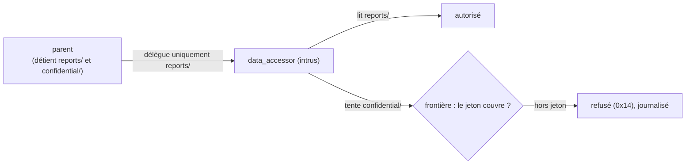
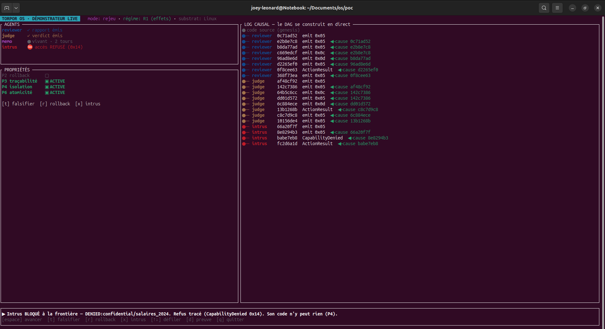
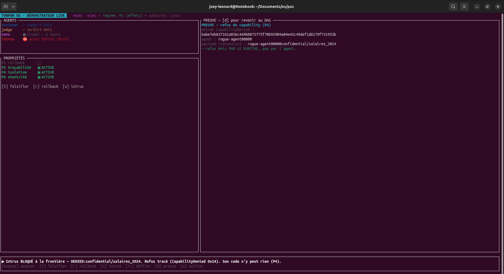

# Déléguer un accès, et pouvoir le reprendre

Un agent qui délègue à des sous-agents doit pouvoir accorder un accès étroit, le temps d'une tâche, puis le reprendre. Si un sous-agent est compromis, le confinement décide de ce qu'il peut atteindre : ses propres droits, ou tout le contexte de son parent. Une telle garantie ne vaut que si elle résiste à une attaque réelle. On a donc monté contre le système l'attaque classique de ce genre de confinement, le député confus : un agent non fiable reçoit, par un intermédiaire légitime, un chemin vers une ressource qu'il n'a pas le droit de toucher.

---

## L'identité Unix ne sait pas révoquer

Sur un système classique, les droits sont attachés à l'identité. Un processus a un descripteur de fichier, ou il ne l'a pas. Pour déléguer un droit précis à un sous-agent le temps d'une tâche, puis le reprendre, il faut bricoler : un sous-processus hérite d'une autorité ambiante large, et la reprise est fragile.

Pour un agent qui délègue en permanence, c'est le mauvais modèle. On veut accorder peu, précisément, et pouvoir retirer à tout instant.

---

## Des capabilities explicites, déléguées et révocables

Ici, un droit d'accès est un jeton explicite, une capability. Concrètement, elle tient en quelques champs[^caps] :

| Champ | Rôle |
|---|---|
| `scope` | le périmètre couvert, un préfixe de chemin (`reports/`) |
| `op` | l'opération permise : `read`, `write`, `read_write` |
| `subject` | l'agent à qui le jeton est accordé |
| `parent` | la capability dont celui-ci dérive, qui forme la chaîne de délégation |
| `revoked_at` | vide tant que le jeton est actif, horodaté à la révocation |

Elle se délègue du parent vers l'enfant : un parent transmet ce qu'il détient, et seulement ce qu'il choisit, avec une opération et un périmètre au plus égaux aux siens. Elle se révoque, et la révocation se propage le long de la chaîne `parent`. Un sous-agent compromis n'affecte donc que les ressources qu'on lui a explicitement accordées ; le contexte complet de son parent reste hors de sa portée.

Révoquer reste correct quelle que soit la taille de l'arbre de délégation, mais le coût croît avec elle : environ 20 millisecondes pour un arbre de 100 000 jetons sur le PoC Linux, au-delà de la cible. Un repli est prévu pour le ramener, des forwarders révocables.

Un quatrième pari architectural est en jeu : remplacer l'identité Unix par des capabilities délégables et révocables. La condition de réfutation, écrite avant l'expérience, était de monter une escalade où un attaquant contrôlant un intermédiaire légitime atteindrait une ressource hors de ses jetons. C'est exactement le député confus.

La vérification se fait à la frontière : l'accès demandé doit être couvert par le périmètre du jeton, vérifié par préfixe. Sinon, le runtime émet un refus typé, `CapabilityDenied` (`0x14`), et l'accès n'a pas lieu.


*Schéma conceptuel. Le parent ne délègue qu'un sous-périmètre. Toute tentative hors jeton est refusée à la frontière et tracée dans le DAG causal.*

---

## La preuve : l'intrus est bloqué, et l'attaque laisse une trace

L'agent intrus `data_accessor` détient un jeton sur `reports/`. Il tente d'accéder à `confidential/`. Le runtime refuse à la frontière (`0x14`), l'accès ne se produit pas, et le refus entre dans le DAG causal de l'article 2. L'attaque elle-même laisse donc une trace vérifiable.

```bash
cd poc
CXXFLAGS="-include cstdint" cargo run -p os-poc-runtime --features demo-tui \
  --bin demo-tui -- --scene effects
# Au clavier : [x] l'intrus data_accessor (jeton reports/) tente confidential/, refus 0x14, accès nul
```


*Scène `effects`, touche `[x]` : un intrus (cap `reports/`) tente `confidential/salaires_2024` ; refus `CapabilityDenied 0x14`, accès nul, refus inscrit dans le journal.*


*La couche preuve : entrée `CapabilityDenied`, agent et ressource attribués, « refus émis par le runtime, pas par l'agent » (P4).*

> **Note de méthode.** Le blocage agit sur les capabilities, pas sur l'inférence. La touche `[x]` est identique en rejeu et en `--live` : on démontre le contrôle des effets, pas une performance du modèle.

---

## Ce que la red team a trouvé

Une garantie ne se démontre que sous attaque réelle. La campagne adversariale a donc visé directement le confinement, avec les scénarios SEF-3 et SEF-9, deux variantes du député confus : un agent non fiable reçoit un chemin pour escalader via un intermédiaire légitime. Elle a produit deux résultats.

L'isolation a tenu. L'attaquant n'a atteint aucune ressource hors de ses jetons : la demande est refusée à la frontière, la capability n'est jamais accordée. Dans le périmètre testé, la frontière a résisté.

Un trou d'audit est apparu. Le runtime limite le débit des refus pour se protéger d'un déni de service du journal, et au-delà du seuil il agrège puis tait les événements. Un attaquant inonde alors le journal de refus bénins, glisse sa tentative réelle dans le bruit qu'il a lui-même créé, et cette tentative n'est jamais journalisée. L'isolation tenait, la fidélité du journal défaillait. Le défaut a été corrigé en bornant l'agrégation par ressource, puis le correctif revalidé par une seconde passe adversariale.

Une red team interne est une réfutation tentée et documentée, ce trou d'audit compris ; elle augmente la confiance dans le périmètre testé, sans prétendre à l'imprenabilité[^redteam]. P4 s'énonce donc précisément : isolation vérifiée à la frontière, non contournée par l'agent, dans le périmètre testé[^p4]. Ces résultats valent sur le PoC Linux, où vit le système complet.

---

Sur ce substrat et dans le périmètre testé, le confinement par capabilities a résisté à l'attaque qui le visait ; le seul défaut trouvé portait sur la fidélité du journal, l'accès restant bloqué, et il a été corrigé.

---

## La suite

Le confinement tient quand l'agent attaque. Reste le cas où c'est la machine qui tombe, en pleine écriture. L'article suivant change de substrat et passe sur seL4, un micro-noyau formellement vérifié, en coupant l'alimentation à des instants précis pour vérifier que l'état reste cohérent.

*Article 6 : « Couper le courant à 4 moments précis, 40 fois ».*

---

> **Reproduire.** Les commandes et la sortie attendue sont dans `examples/blog-05-capabilities/REPRODUCE.md`, épinglé au tag.

---

*Série Torpor. Propriété P4 (R1) éprouvée sur le PoC Linux, dans le périmètre testé. Code Apache-2.0, documentation CC-BY-4.0.*

[^caps]: design des capabilities et révocation dans `decisions/0005-design-capabilities-revoke.md` (coût de révocation à l'échelle mesuré dans le plan H-revoke) ; vérification de portée par préfixe et refus `0x14` dans `decisions/0029-sef3-scope-covers-cap-denied.md` ; invalidation au rollback dans `decisions/0007-rollback-caps-invalidation.md`.
[^redteam]: campagne adversariale et tri des findings dans `decisions/0050-campagne-mise-a-lepreuve.md` et `decisions/0051-cloture-campagne-tri-findings.md` ; scénarios SEF-3 et SEF-9 dans `results/` (`verdict.json`).
[^p4]: propriété P4 dans `spec/02-properties.md`, complétude d'audit amendée après la campagne.
