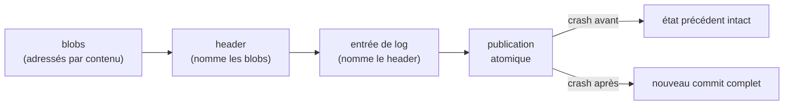

# Un crash en plein commit ne laisse rien à moitié

Entre deux actions, l'état d'un agent vit sur disque. Si le processus tombe en pleine écriture, cet état peut rester à moitié écrit, une corruption silencieuse : une perte franche se verrait au redémarrage, tandis qu'un état à demi écrit se lit comme intact et que l'agent le reprend tel quel. Pour un agent long-courrier qui accumule son état, un seul commit laissé à moitié empoisonne tout ce qui en dépend ensuite. La seule issue acceptable est le tout ou rien : après un crash, le dernier commit est entièrement présent, ou entièrement absent, jamais partiel. C'est la propriété P6, atomicité au crash, l'une des propriétés de correction que le projet arbitre avant la densité.

Le problème est ancien et bien résolu ailleurs. Les bases de données garantissent des commits atomiques par un journal d'écriture anticipée, le write-ahead log, et des transactions ACID ; les systèmes de fichiers journalisés font de même pour leurs métadonnées. Et la façon éprouvée de tester cette atomicité est l'injection de fautes à des points précis, les failpoints, telle que la pratiquent TiKV ou FoundationDB : on arme un crash à chaque frontière de la séquence de commit, on rejoue, et on vérifie qu'aucun état intermédiaire n'a fui.

Deux choses distinguent ce qui est tenté ici. La couche d'abord : l'atomicité est une garantie du substrat, acquise sous l'agent, à même la couche de stockage. Le socle ensuite : la propriété est portée et testée sur seL4. La correction fonctionnelle de ce micro-noyau a fait l'objet d'une preuve formelle, établie par ses auteurs ; le projet ne la refait pas, il s'appuie dessus. Une atomicité au crash ne vaut que si le noyau qui l'exécute ne corrompt pas lui-même l'état, et seL4 fournit ce rare socle déjà prouvé.

---

## Le portage sur seL4

Le portage a suivi une chaîne d'intégration, des jalons C.1 à C.11[^stack] :

- Wasmtime tournant dans un processus seL4 sans bibliothèque standard (`no_std`).
- Un fork no_std de redb, magasin clé-valeur persistant, au-dessus d'un périphérique bloc virtuel (virtio-blk).
- Durcissement W^X (write-xor-execute) sur le pool de compilation JIT[^wx].
- Commit multi-agent avec des badges de capability par agent.

Le moteur de stockage diffère selon le substrat. Le PoC Linux mesuré aux articles 2 à 4 tourne sur RocksDB ; sur seL4, RocksDB est hors course, écrit en C++ et lié à la bibliothèque standard, incompatible avec le `no_std` qu'impose le micro-noyau. La cible seL4 utilise donc un fork no_std de redb, un B-tree en Rust pur porté pour tourner sans système d'exploitation sous lui. Les latences mesurées sur RocksDB et Linux valent pour RocksDB et Linux ; la cible redb et seL4 a les siennes.

---

## La preuve : W^X appliqué, puis atomicité au crash

Deux choses sont montrées. La première porte sur le W^X (write-xor-execute), qui interdit qu'une même page mémoire soit à la fois inscriptible et exécutable, et coupe ainsi la voie classique d'un attaquant : écrire du code, puis l'exécuter. La contrainte est délicate pour le compilateur à la volée (JIT) de Wasmtime, qui produit du code machine pendant l'exécution et doit donc, par nature, écrire puis exécuter. La réponse est une bascule contrôlée des permissions : le pool de compilation occupe des frames dédiées, tenues inscriptibles et non exécutables, que le superviseur bascule en exécutable au moment de lancer le code généré. À aucun instant une page n'est inscriptible et exécutable en même temps.

Le test vérifie cette frontière par la négative. Le script `demo-isolation.sh` construit et démarre le noyau sous QEMU AArch64, un émulateur qui simule une machine ARM en logiciel, puis tente une écriture sur une page exécutable.

```bash
cd poc/sel4-hello
./demo-isolation.sh   # build + boot QEMU AArch64, puis test négatif W^X
```

seL4 refuse l'opération et lève une faute. La sortie du noyau, reprise verbatim du dépôt[^transcripts], marque :

```
C10_NEG_PASS
```

La protection vient de seL4 ; le test confirme seulement que le durcissement du projet la déclenche comme prévu.

La seconde est l'atomicité, et elle tient par construction du protocole de commit. Le principe est celui du modèle d'objets de Git : des contenus adressés par leur hash, qu'une référence finale rend visibles d'un coup. L'état de l'agent est d'abord écrit en blobs, chacun désigné par l'empreinte SHA-256 de son contenu. Vient ensuite un header qui nomme ces blobs par leur hash. Puis une entrée de log qui nomme le header. La publication de cette entrée est l'unique opération atomique : tant qu'elle n'a pas eu lieu, l'état autoritaire reste le commit précédent ; une fois faite, le nouveau commit est visible, et comme tout ce qu'il nomme a été écrit avant lui, le header et les blobs référencés sont nécessairement présents.

De ce protocole, le comportement au crash se déduit. On tue malgré tout le runtime à quatre instants, par un `tcb_suspend` qui gèle le processus sans retour possible : après l'écriture des blobs, après celle du header, après l'entrée de log mais avant le retour de l'appel système, et après ce retour. Ces quatre points sont les frontières de transition du protocole : un crash survenant entre deux d'entre elles retombe sur l'état de la frontière précédente. Les énumérer toutes couvre donc l'ensemble des cas, quand un échantillonnage aléatoire n'en atteindrait qu'une part.

À chaque point, rejoué de façon déterministe par le harnais, le verdict est le même[^p6] : avant la publication, l'état autoritaire est le commit précédent ; après, le nouveau commit est entier. Aucun point intermédiaire ne laisse l'état à moitié écrit. L'oracle vit dans le serveur de stockage, un processus seL4 distinct qui survit au gel du runtime ; il vérifie la fermeture descendante des références, toute entrée présente résolvant son header et tout header ses blobs, et tolère des contenus écrits en avance que rien ne nomme, puisqu'ils restent invisibles.


*Le commit est publié à un point atomique unique. Un crash de part et d'autre laisse l'état précédent ou le nouveau commit, toujours entier. seL4 sur QEMU AArch64, gel par `tcb_suspend`.*

---

## Ce que « démontré sur seL4 » veut dire exactement

Le substrat est QEMU AArch64 : tout tourne en émulation logicielle, sur un prototype de recherche, et le portage sur une carte ARM physique reste à faire. Le `tcb_suspend` modélise un crash de processus ; la durabilité à la perte d'alimentation reste hors périmètre, parce qu'elle exige une vraie coupure matérielle que QEMU ne reproduit pas. L'acquittement de commit est de niveau serveur, comme le régime SIGKILL du PoC Linux, ce qui le distingue d'une écriture physique survivant à une coupure. Tout cela porte sur la correction, l'isolation et l'atomicité, et la latence reste en dehors : aucune performance seL4 n'est revendiquée, et sous émulation la latence ne dirait rien d'un matériel réel[^cloture].

Une réserve d'architecture, enfin. Ici, l'atomicité tient parce que redb enveloppe toute la séquence de commit dans une seule transaction, soit une garantie plus forte que celle visée par l'architecture cible, où l'atomicité reposerait sur un ajout atomique à un journal séparé. La propriété est donc tenue, mais cette architecture-là n'est pas encore instanciée.

P6 garantit que le crash ne corrompt pas l'état. Il ne dit rien de la justesse de ce que l'agent avait décidé d'écrire.

---

## La suite

Six articles ont mis à l'épreuve six propriétés ou choix. L'article suivant prend du recul sur les décisions de fond qui les sous-tendent : un DAG plutôt qu'un arbre, RocksDB plutôt que SQLite, WebAssembly plutôt qu'un conteneur. Chacune était un pari falsifiable, dont la condition de réfutation était écrite avant l'expérience, et il les reprend une par une.

*Article 7 : « Pourquoi pas Docker, SQLite, ou Unix ? »*

---

> **Reproduire.** La reproduction exige la toolchain seL4 et QEMU AArch64, pas un simple « extraire et lancer ». Les harnais d'atomicité au crash (`c6-crash`, `c7-crash`, `c10-crash`) et la procédure complète sont dans `examples/blog-06-crash-sel4/REPRODUCE.md`. Sans la toolchain, le transcript réel ci-dessus et la figure restent l'illustration accessible.

---

*Série Torpor. Propriété P6 (R1) sur substrat seL4 (Wasmtime no_std, redb, virtio-blk, QEMU AArch64), portée crash-processus. Code Apache-2.0, documentation CC-BY-4.0.*

[^stack]: portage seL4 du runtime (Wasmtime min-platform `no_std`) dans `decisions/0037-stack-runtime-sel4.md` ; moteur redb sur virtio-blk dans `decisions/0042-voie-b3-moteur-index.md` et `decisions/0041-voie-b2-driver-block.md`.
[^wx]: durcissement W^X du pool JIT (jalons C.10 et C.11) dans `decisions/0047-jalon-c10-wx-jit-sel4.md` et `decisions/0048-jalon-c11-wasm-non-confie.md`.
[^p6]: protocole de commit (ordre blobs, header, log ; oracle de cohérence) dans `decisions/0038-store-natif-sel4.md` et `decisions/0043-integration-verticale-c6.md` ; validation aux quatre points de kill (C.6, C.7) dans `decisions/0043-integration-verticale-c6.md` et `decisions/0044-integration-verticale-c7.md` ; propriété P6 dans `spec/02-properties.md`.
[^transcripts]: transcripts réels du noyau et harnais déterministes dans `docs/demo/sel4-transcripts/` et `poc/sel4-hello/{c6-crash,c7-crash,c10-crash}/test.py`.
[^cloture]: clôture du PoC seL4 et périmètre de transférabilité dans `decisions/0049-cloture-poc-sel4.md` et `decisions/0065-position-transferabilite-reserves-permanentes.md`.
