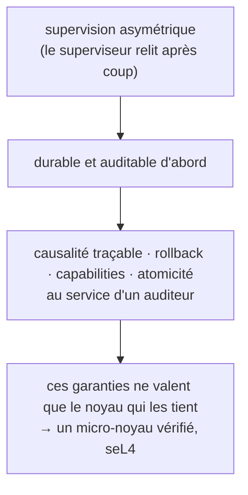

# Une garantie ne vaut que son noyau

Les six articles précédents ressemblent à une collection de décisions séparées : un format de journal, un moteur de stockage, un modèle d'isolation, un schéma de droits. Elles forment un seul système, avec une racine unique, et la décision la plus lourde se trouve tout en bas, là où elle n'a pas encore été jouée jusqu'au bout.

---

## La racine : le superviseur relit après coup

La racine est l'asymétrie de supervision, posée à l'article 1. Le superviseur humain observe, intervient et autorise, mais hors du temps réel : il relit à l'échelle de l'heure ou du jour, pas de la microseconde. De cette seule asymétrie découle un système conçu durable et auditable d'abord, parce que c'est par l'historique relu que l'humain comprend et corrige[^supervision].

Les propriétés des articles précédents sont les conséquences de cette racine. La causalité traçable d'un journal infalsifiable, le rollback transactionnel, le contrôle d'accès par capabilities, l'atomicité au crash servent toutes le même but : permettre à un auditeur de relire et de défaire après coup, là où d'autres systèmes optimiseraient le débit. L'isolation WebAssembly, elle, sert la densité, pour qu'un agent endormi coûte presque rien. Le moteur de stockage, lui, découle directement du substrat : RocksDB sur le PoC Linux, redb sur la cible seL4, chacun choisi sous ses propres contraintes.

*Schéma conceptuel. La racine dicte les propriétés, et les propriétés exigent un noyau qui les tienne.*

---

## Le pari du dessous : un noyau vérifié

Toute cette logique repose sur une hypothèse silencieuse, que les garanties d'audit et d'isolation tiennent. Or une garantie ne vaut que ce que vaut le noyau qui l'exécute. Sur le PoC Linux, ces garanties reposent sur de l'isolation logicielle, et c'est là leur limite. Les agents partagent un même processus système, si bien qu'une évasion du bac à sable WebAssembly compromet tous les autres. Le W^X, qui interdit qu'une page mémoire soit à la fois inscriptible et exécutable et protège ainsi le code généré, est un `mprotect()` logiciel, l'appel système qui change les permissions d'une page, qu'une escalade de privilège peut révoquer. Et sous tout cela, la base de confiance, le code en qui il faut avoir confiance pour que la sécurité tienne, fait quelque trente millions de lignes non prouvées, où les escalades de privilège sont une classe de failles active.

Le vrai pari de substrat répond à cette limite : porter le système sur un micro-noyau dont la correction fonctionnelle est prouvée, seL4. Le pari change ce que chaque garantie devient. Une évasion du bac à sable reste cantonnée à un seul espace d'adressage, le micro-noyau bloquant tout accès d'un agent à la mémoire d'un autre. Le W^X est tenu par les tables de pages et par des capabilities que le domaine de l'agent ne peut pas révoquer. Et la base de confiance tombe à environ neuf mille lignes de C, avec une preuve formelle d'intégrité, sans escalade de privilège publiée sur le code prouvé[^classes].

Trois choses séparent l'argument de l'acquis. La preuve de correction est celle de seL4, établie par ses auteurs ; le projet s'appuie dessus sans la refaire. Les deux premiers effets, le confinement d'une évasion à un espace d'adressage et le déclenchement du W^X, ont été démontrés, mais sous QEMU, un émulateur qui simule la machine en logiciel : le mécanisme part bien, et l'article 6 en montre la sortie noyau. La protection par les tables de pages, elle, reste l'argument sur silicium réel, et le passage à une carte physique n'a pas été fait. Le pari de substrat est donc posé et étayé, mais c'est celui qui reste le moins joué de toute la série[^sel4].

---

## La suite

Les paris de cette série ont tous tenu, ou attendent encore le matériel qui les jouera pour de bon. Le dernier article regarde une autre forme de vérité : les fois où un pari a été joué, et où la donnée a dit non.

*Article 8 : « Trois fois, nos données ont contredit notre modèle ».*

---

*Série Torpor. Argument de substrat ; démonstrations seL4 en émulation QEMU, bornes de performance sur PoC Linux. Code Apache-2.0, documentation CC-BY-4.0.*

[^supervision]: modèle de supervision asymétrique dans `decisions/0006-modele-supervision.md` ; racine posée à l'article 1.
[^classes]: comparaison Linux/seL4 des trois classes (évasion du bac à sable, W^X, base de confiance) dans `SYNTHESE.md` et `spec/08-modele-menace.md` ; confinement inter-espaces démontré en C.7-crash (`decisions/0044-integration-verticale-c7.md`), W^X en C.10 (`decisions/0047-jalon-c10-wx-jit-sel4.md`).
[^sel4]: choix du micro-noyau seL4 et appui sur sa preuve formelle de correction (Klein et al. 2009) dans `decisions/0037-stack-runtime-sel4.md` ; périmètre de transférabilité et part matérielle non jouée dans `decisions/0065-position-transferabilite-reserves-permanentes.md`.
