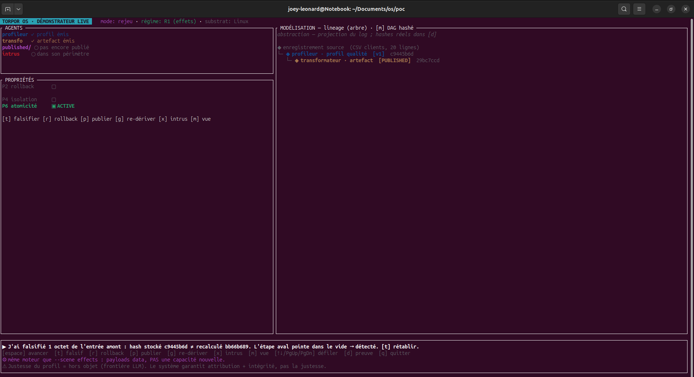
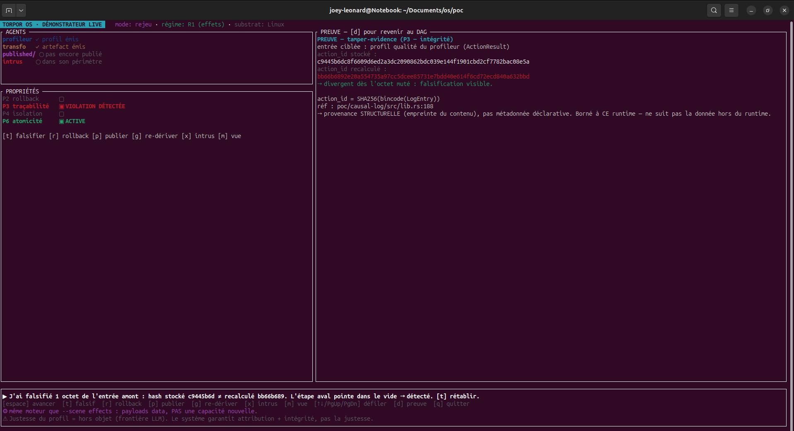

# Des effets maîtrisables

Les sept articles précédents ont établi que les propriétés tiennent : un journal causal infalsifiable, un rollback transactionnel, un contrôle d'accès révocable, une atomicité au crash, une isolation légère. Cet article répond à ce qu'ils laissent de côté, une fois ces propriétés réunies : ce qu'on en fait.

Le domaine de ce système, ce sont les effets d'un agent, ce qu'il touche, ce qu'on peut relire, ce qu'on peut défaire. La qualité de ses décisions, elle, reste hors champ. Et sur ces effets, le système offre trois prises : un lineage infalsifiable, une annulation propre, une isolation que l'agent ne peut pas contourner.

---

## Sur un pipeline de données

Prenons le cas que la démonstration du projet met en scène, un pipeline de données conduit par deux agents. Un premier agent profile un enregistrement clients, repère les champs, les types, les manques. Un second en dérive une sortie normalisée et la publie. Le lien que le second inscrit vers le premier est l'empreinte SHA-256 de ce que le premier a produit. Là où dbt ou Airflow enregistrent une dépendance déclarée, de bonne foi, celle-ci est ancrée dans le contenu lui-même : c'est du lineage structurel[^demo].

Cette différence se voit dès qu'on triche. Si une sortie amont est modifiée après coup, son empreinte recalculée ne tombe plus sur celle que l'étape aval avait enregistrée : la chaîne casse, visiblement, et l'entrée aval devient orpheline. La falsification est détectable par un tiers, sans confiance accordée à qui a écrit. C'est tamper-evident, ce qui rend une altération visible sans pour autant l'empêcher.

Quand une étape est fautive, un superviseur l'annule. L'état revient exactement au point d'avant, d'un bloc, sans état intermédiaire observable. Et l'annulation fait plus que défaire : elle révoque le droit de publier attaché à cette étape. Une republication aveugle est alors refusée, tracée comme un accès interdit, tant que l'étape n'a pas été re-dérivée proprement et son nouveau résultat retransmis. La correction est une séquence explicite, là où un écrasement de fichier passerait inaperçu.

L'isolation se vérifie sur un cas franc. Un agent intrus tente d'atteindre un export de données sensibles, hors du périmètre que ses jetons lui accordent. Il est arrêté à la frontière du bac à sable, et le refus est inscrit dans le journal, horodaté et attribué à l'agent fautif.

Un dernier cas marque la frontière du système. Quand le modèle se trompe, quand le profileur rate des champs manquants et que le transformateur publie quand même, le lineage reste parfaitement intègre et attribué : il enregistre fidèlement une décision fausse. L'intégrité d'un historique n'est pas la justesse de ce qu'il contient, et le système ne prétend qu'à la première.

Tout ce qui précède est rejouable. La scène tourne sur des réponses enregistrées d'un vrai run, ce qui isole le contrôle des effets de toute performance d'inférence :

```bash
cd poc
cargo run -p os-poc-runtime --features demo-tui --bin demo-tui --release -- --scene lineage
```


*Scène `lineage`, touche `[t]` : l'octet modifié casse la chaîne, le hash recalculé diverge du hash stocké, l'étape aval devient orpheline.*


*La couche preuve : `P3 traçabilité — violation détectée`, `action_id stocké ≠ recalculé`. Provenance structurelle, bornée à ce runtime.*

---

## Deux régimes et une frontière

Une frontière d'abord, parce qu'elle conditionne le reste. Le modèle apporte la capacité de l'agent ; le substrat apporte les conditions dans lesquelles l'exploiter. Améliorer la capacité d'un modèle, par le fine-tuning ou un meilleur contexte, n'est pas l'objet de ce système. Ce qu'il garantit, c'est le contrôle des effets, quelle que soit la qualité des décisions.

Ce contrôle a une propriété commode : il ne dépend pas de l'endroit où tourne le modèle. La traçabilité, le rollback, l'isolation et l'atomicité restent actifs même si l'inférence passe par une API distante. C'est le premier régime de valeur. Le second, le contrôle des ressources, la densité d'agents endormis et le déterminisme du pool d'inférence, n'est actif que si l'inférence tourne en local, là où le substrat ordonnance le modèle lui-même[^regimes].

Cela situe le système par rapport à ce qui existe. Les bacs à sable d'agents isolent l'exécution ; les moteurs d'exécution durable rejouent des workflows après une panne. Le lineage causal et le rollback intégrés au substrat ne se trouvent dans aucune de ces deux familles : ailleurs, le lineage est déclaratif et le rollback se réécrit dans chaque application. La cible est une organisation qui veut faire tourner une flotte d'agents de façon dense et auditable, sur du matériel qu'elle possède.

---

## Une seule logique

Vu de loin, ces choix forment une seule chaîne. La supervision asymétrique en est la racine, un humain qui relit après coup, hors du temps réel. De là vient un système durable et auditable d'abord, et de là viennent les propriétés, la causalité traçable, le rollback, les capabilities, l'atomicité, qui servent toutes un auditeur qui relit. L'isolation légère sert la densité. Et sous tout cela, le pari du substrat, un micro-noyau vérifié, parce qu'une garantie ne vaut que ce que vaut le noyau qui la tient.

Deux substrats portent cette chaîne. Le PoC Linux, où toutes les mesures ont été prises, et un second prototype sur seL4, où l'intégration a été démontrée sous émulation, le matériel réel restant la part non jouée. Une méthode les relie : chaque choix a été posé comme un pari, avec sa condition de réfutation écrite avant l'expérience ; les mesures déclarent leur régime et leur substrat ; et les fois où la donnée a contredit le design ont été publiées comme telles.

Le statut, pour finir. C'est un prototype de recherche, dont le but est d'isoler un besoin que les systèmes classiques ne servent pas et de le mettre à l'épreuve, y compris en l'attaquant. Certaines directions sont conçues sans être livrées, comme le lien sémantique fort entre agents de tenants différents[^limites]. Ce qui est démontré l'est sous son régime et son substrat. Reste, au bout, un système qui prend les effets d'un agent et les rend relisables, réversibles et confinés.

---

> **Reproduire.** La scène `lineage` tourne en mode rejeu sans dépendance externe ; le mode `--live` rebranche un modèle local via Ollama, et la variante `--llm-wrong` montre un modèle faillible dont le lineage reste pourtant intègre. Procédure complète dans `examples/blog-08-demo/REPRODUCE.md`.

---

*Série Torpor. Scène et verdicts sur PoC Linux (régime des effets) ; bornes citées avec leur substrat. Code Apache-2.0, documentation CC-BY-4.0.*

[^demo]: scène `lineage` et cas d'usage data engineer dans `docs/demo/atelier-data-inge-use-case.md` et `docs/demo/demo-tui-guide.md`.
[^regimes]: les deux régimes de valeur (effets, ressources) et le modèle de supervision dans `docs/onboarding-parcours.md` et `decisions/0006-modele-supervision.md`.
[^limites]: lien sémantique fort cross-agent conçu non livré dans `decisions/0036-autorité-causale-agent-add-cause.md` ; périmètre de substrat et de transférabilité dans `decisions/0065-position-transferabilite-reserves-permanentes.md`.
